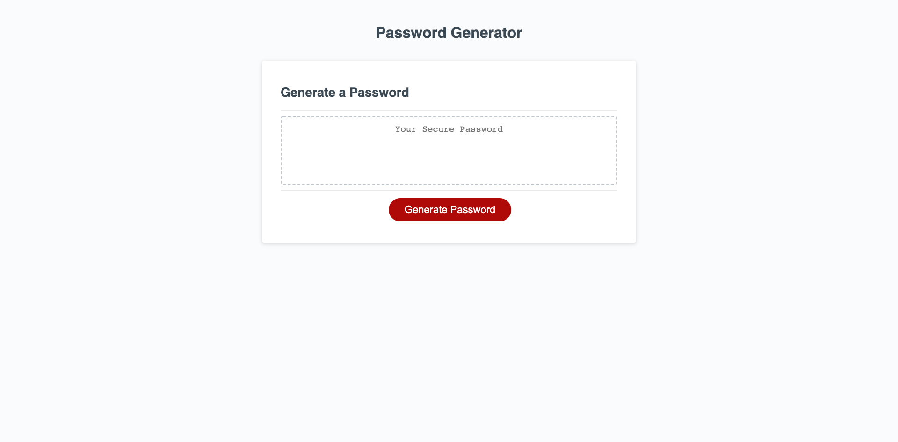
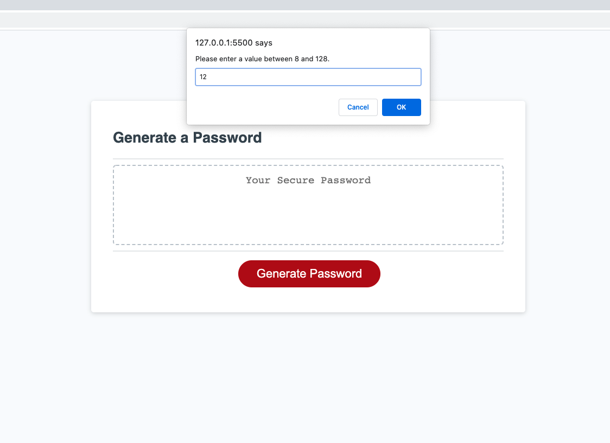
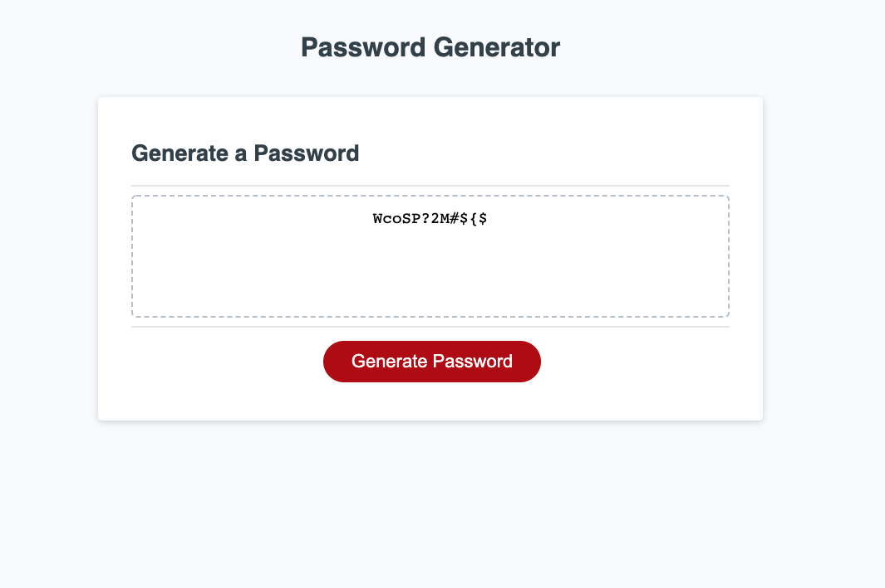

# Password_Generator
<h2>HW-03</h2>

## What was your motivation?
- This project really allowed me to test my skills in javascript.
- After learning about js from scratch, I felt confident in my skills to replicate the password generator.

## Why did I build this project?
- I was always curious on how password generators were randomized. 
- Before I looked into the code, I would've never realized how much code is put into making a string random.

## What problem does it solve?
- I ran into some problems making things random.
- Intially, I wanted to separate everything into functions, but as I ran my code, I concluded that it was best to just leave my code out of their function tags and
put it directly into generatePassword().

## What did I learn?
- The complexity of "if else" statements and "for loop" statements.
    - I had a good understanding of them while in class, but putting the skills to practice was a lot harder than I thought.
- Scoping was also quite useful during the trial phases of my project, but for simplicity reasons, it made more sense to me to leave them out moving forward with the project.

## Link to URL
https://dn-vanguard.github.io/Password_Generator/

## Screenshots

